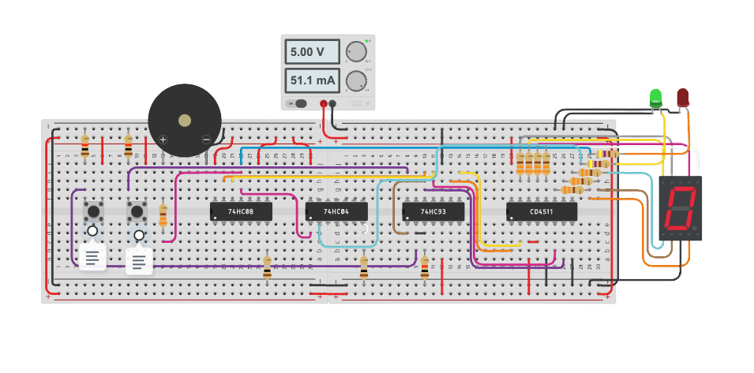

<!-- Repository Banner -->
<p align="center">
  
</p>

---

## 🔹 Overview

This repository contains the implementation of a **digital elevator people-counting circuit** built using standard digital ICs, IR sensors, logic gates, a 7-segment display, and LED indicators. The circuit counts people entering an elevator (0–9), displays the count, and triggers safety indicators when the capacity limit is reached.
>See the demo video below for a quick visual explanation of how the system works.
<p align="center">
  
</p>
 
>Full system description referenced from project documentation.

---

## 🔹 Project Description

This project implements the assignment requirement for **IE2010 – Digital Electronics, Semester 1 (2020)**.  

- The elevator can carry a **maximum of 9 people**  
- A **digital IR sensor** detects people entering  
- Count is shown on a **single 7-segment display**  
- **Green LED ON** when count < 9  
- **Red LED + Buzzer ON** when count ≥ 9  
- Use a **74193 / 74HC93 counter**  
- Use a **7447 / CD4511 BCD-to-7-segment decoder**  
- Power the circuit using USB / 5V supply

This repository contains a full working implementation using a **breadboard prototype**.

---

## 🔹 Circuit Overview

>### Circuit Architecture
<p align="center">
  
</p>

Below is the breadboard implementation used for the project: <a href="https://www.tinkercad.com/things/hYpgCl7IjPe-7-segment-display/editel" target="_blank">Go see the project on Tinkercad</a>




---

## 🔹 Components Used

### **Digital ICs**
- **74HC93** – 4-bit binary counter  
- **CD4511** – BCD to 7-segment decoder  
- **74HC08** – AND gate (logic conditions)  
- **74HC04** – Inverter (signal conditioning)

### **Sensors & Indicators**
- **IR sensors** × 2 (people detection)  
- **Buzzer module** (over-capacity alert)  
- **Green LED** (safe state)  
- **Red LED** (over-capacity state)  
- **Common Cathode 7-segment display**

### **Passive Components**
- Resistors (for LEDs, pull-down logic, IR modules)  
- Connecting wires  
- Breadboard  
- USB 5V power supply

---

## 🔹 Power Configuration

- 5V supplied via USB  
- Breadboard rails distribute **+5V** and **GND**  
- ICs powered through Vcc and GND pins  
- LEDs current-limited with series resistors  
- Buzzer triggered via control logic

---

## 🔁 Working Principle

>### **1. Person Detection**
- IR sensor output transitions from **HIGH → LOW** when a person passes  
- A pulse is fed into the **74HC93 counter**  
- Counter increments by 1 per detection

>### **2. Counting Logic**
- The **74HC93** outputs a 4-bit binary number  
- This binary output is sent to the **CD4511 decoder**

>### **3. Displaying the Count**
- CD4511 converts BCD to 7-segment signals  
- The 7-segment display shows numbers **0 to 9**

>### **4. Capacity Detection Logic**
Using **AND gates (74HC08)** and **inverters (74HC04)**:

- If count **< 9** →  
  - **Green LED = ON**  
  - Red LED = OFF  
  - Buzzer = OFF  

- If count **≥ 9** →  
  - **Red LED = ON**  
  - **Buzzer = ON**  
  - Green LED = OFF  

---

## 🔹 Logic Table

| Count | Binary (QdQcQbQa) | Display | Green LED | Red LED | Buzzer |
|-------|-------------------|---------|------------|----------|--------|
| 0     | 0000              | 0       | ON         | OFF      | OFF    |
| 1–8   | 0001–1000         | 1–8     | ON         | OFF      | OFF    |
| 9     | 1001              | 9       | OFF        | ON       | ON     |

---

## 🔹 Testing

### Tested scenarios:
- IR sensor properly detects hand/obstacle  
- Counter increments correctly  
- 7-segment displays correct digit  
- LED indicator changes at threshold = 9  
- Buzzer triggers when count ≥ 9  
- Current draw measured ≈ 50–55mA (safe for USB 5V)

---

## 🔹 License

This project is licensed under the **MIT License**.  
See the `LICENSE` file for details.

---

## 🔹 Citation

If you use or reference this work in academic or technical documents, please cite:
```bash
Kasthuriarachchi, S.D., Perera, H.A.K.D., Jayasekera, P.Y.R., and Liyanage, R.S.H. (2020) Digital Circuit for an Elevator.[Online] Available at: https://github.com/sadeep654/Digital-Circuit-for-an-Elevator (Accessed: date-you-accessed).
```
---

## 👤 Authors

>- Kasthuriarachchi, S.D.
>- Perera, H.A.K.D.
>- Jayasekera P.Y.R 
>- Liyanage R.S.H.
```bash
Copyright (c) 2020 Sadeep Dilshan Kasthuriarachchi
```


